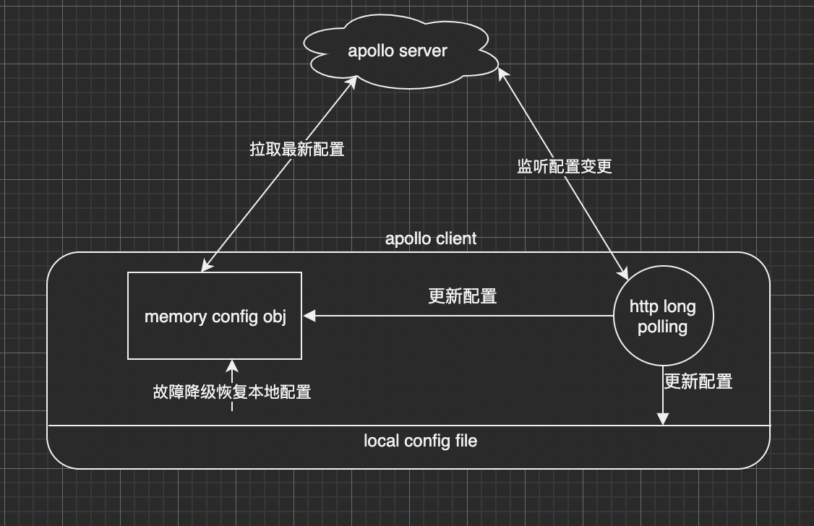

🌈🌈🌈 这是用Node.js编写的Apollo（配置中心）客户端

扫码进交流群


## Introduction

[Apollo（阿波罗）](https://github.com/ctripcorp/apollo)是携程框架部门研发的分布式配置中心，能够集中化管理应用不同环境、不同集群的配置，配置修改后能够实时推送到应用端，并且具备规范的权限、流程治理等特性，适用于微服务配置管理场景。

**本项目为Node.js 客户端,工作原理如下：**


配置中心配置以点分隔如 `mysql.host:127.0.0.1`  ,客户端会自动转化为Json 
```
{ mysql:{ host: 127.0.0.1 } } }
```


## apollo 服务端测试环境:
Examples 使用下面的环境作为测试服务，可直接运行。

* host: http://106.54.227.205/
* 账号: `apollo`
* 密码: `admin`

## Features
* 配置热更新
* 缓存配置到本地
* 灰度发布
* 支持 TypeScript

## Install

`npm i @lvgithub/ctrip-apollo-client`

## Links

* [Install](https://www.npmjs.com/package/@lvgithub/ctrip-apollo-client)
* [Getting Started](https://github.com/lvgithub/ctrip-apollo-client/blob/master/docs/GettingStarted.md)
* [API  Reference](https://github.com/lvgithub/ctrip-apollo-client/blob/master/docs/API.MD)

## Examples

* [js-demo](https://github.com/lvgithub/ctrip-apollo-client/blob/master/example/js-demo)

* [ts-demo](https://github.com/lvgithub/ctrip-apollo-client/tree/master/example/ts-demo)

* [koa-demo](https://github.com/lvgithub/ctrip-apollo-client/blob/master/example/koa-demo)

## Benchmark
| 注入方式            | 性能                    | 用例数          |
| ------------------- | ----------------------- | --------------- |
| 不热更新            | **736,896,802** ops/sec | 82 runs sampled |
| 热更新 `hotValue()` | **2,021,310** ops/sec   | 87 runs sampled |
| 热更新 `@value`     | **2,161,312** ops/sec   | 87 runs sampled |
| 原生访问            | **704,644,395** ops/sec | 82 runs sampled |

## [License](https://github.com/lvgithub/ctrip-apollo-client/blob/master/LICENSE)

MIT
